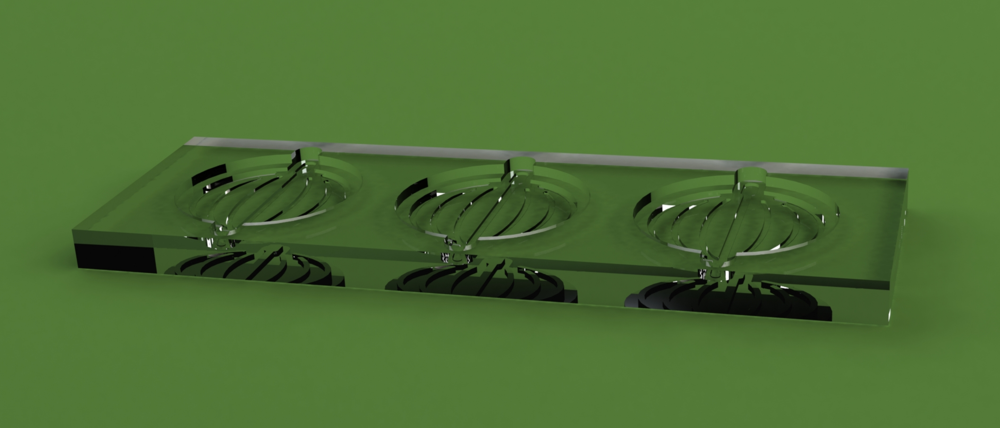
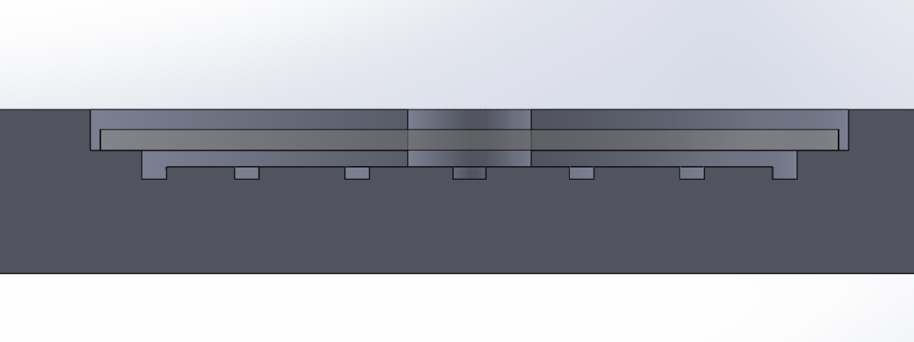
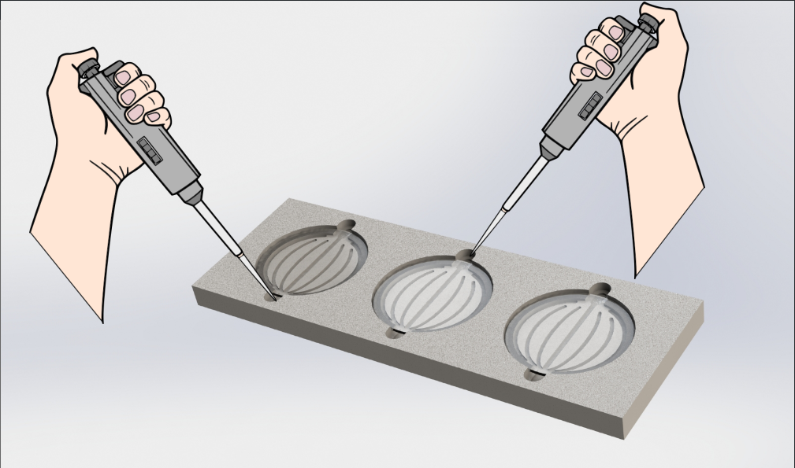

# Cell-Washing-Chamber

<i>Ad-hoc</i> washing chamber designed to perform delicate washings on cells (in this case we used diatom cells but virtually any cell type can be used) fixed on a 18mm round glass cover slip ([reference](https://www.marienfeld-superior.com/cover-glasses-thickness-no-1-circular.html))

The chamber enables gentle washing of the cells while ensuring easy retrieval of the cover slip with the fixed cells, without detaching or damaging them, thus preserving their viability which was crucial in our case. The gentle flow of washing buffer is acheived through capillarity. In fact, the chamber is designed to elevate the cover slip 200μm above the chamber base (Figure 1). Two niches are provided for the insertion and retrieval of the buffer using a micropipette. Additionally, grooves facilitate the proper flow of the buffer during retrieval which was not optimal in previous groveless versions.

  

Figure 1: Side cut of the chamber. The glass cover slip is in position

Two niches are provided for the insertion and retrieval of the buffer using a micropipette. Additionally, grooves facilitate the proper flow of the buffer during retrieval which was not optimal in previous groveless versions.

  

Figure 2: Buffer loading and unloading illustration 

The following gif shows how buffer can be easily inserted and removed from the washing chamber (Full video [here](https://youtu.be/eTJ1GoubKlY))

  

# 3D models
3D design models are available here:
<a href="3D_models/Washing_chamber_v4.STL" download>STL</a> 
<a href="Washing_chamber_v4.STEP" download>STEP</a>

# Attribution and license
Designed by Matteo Scarsini in collaboration with Petre Bulankva and Paul Triquard at the Phytogenomics lab, IBENS, Paris
The washing chamber is licensed under CC BY-NC-SA 4.0. To view a copy of this license, [visit creativecommons.org/licenses/by-nc-sa/4.0/](http://creativecommons.org/licenses/by-nc-sa/4.0/)
